# FieldFlow

FieldFlow is a full-stack field service management system developed as the final project for the CCA Full-Stack Developer eight-week internship.

The system helps organizations manage customers, technicians, work orders, assignments, job progress, completion notes, and operational dashboards through role-based access.

## Project Status

**Core system:** Completed
**Testing:** Completed
**Deployment:** Completed
**Documentation:** In progress

The project was developed incrementally according to the requirements defined in the CCA Full-Stack Developer Internship Project Brief.

---

## Features

### Authentication and Role-Based Access

* Email/password authentication using Better Auth
* User sign-in and sign-out
* Protected application pages
* Server-side authorization checks
* Role-aware navigation
* Three system roles:

  * Admin
  * Dispatcher
  * Technician

### User Management

* Admin user management
* User role management
* Technician accounts connected to technician profiles
* Role-based access restrictions

### Customer Management

* Create customers
* View customer details
* Edit customer information
* Search customers
* Validate customer input
* Prevent duplicate customer email addresses
* View related work orders

### Technician Management

* Create technicians
* View technician details
* Edit technician information
* Search and filter technicians
* Manage technician skills
* Manage technician availability/status
* Connect technician profiles to user accounts
* View assigned work orders

### Work Order Management

* Create work orders
* View work-order details
* Edit work orders
* Assign technicians
* Filter work orders
* Manage priority
* Manage work-order status
* Delete eligible work orders
* Record activity history
* Add technician progress notes
* Add completion notes
* Complete work orders
* Server-side authorization for work-order actions

### Technician Workflow

Technicians can:

1. View their assigned jobs
2. Open a work order
3. Start assigned work
4. Add progress notes
5. Complete the work order with completion notes
6. View the activity history of their assigned jobs

Technicians cannot access or modify work orders that are not assigned to them.

### Dashboards

The application provides role-specific dashboards.

Dashboards include information such as:

* Open work orders
* Assigned work orders
* Completed work orders
* Available technicians
* Busy technicians
* Recent work orders
* Technician-specific job statistics
* Quick navigation links
* Empty states

---

## User Roles

| Role           | Main Responsibilities                                                                              |
| -------------- | -------------------------------------------------------------------------------------------------- |
| **Admin**      | Manage users, view system records and dashboards, and perform administrative work-order operations |
| **Dispatcher** | Manage customers and technicians, create and assign work orders, and track work progress           |
| **Technician** | View assigned jobs, start work, add progress notes, and complete assigned jobs                     |

Authorization is enforced on the server. Hiding a navigation link or button is not treated as sufficient protection.

---

## Main Work Order Workflow

The main FieldFlow workflow is:

Dispatcher
    │
    ▼
Create Work Order
    │
    ▼
Assign Technician
    │
    ▼
Technician sees job in My Jobs
    │
    ▼
Start Work
    │
    ▼
Add Progress Notes
    │
    ▼
Add Completion Notes
    │
    ▼
Complete Work Order
    │
    ▼
Dashboard / Work Order History Updated
```

Work-order statuses are:

OPEN
  │
  ▼
ASSIGNED
  │
  ▼
IN_PROGRESS
  │
  ▼
COMPLETED
```

A work order can also be cancelled according to the application's business rules.

---

## Screenshots

### Home Page

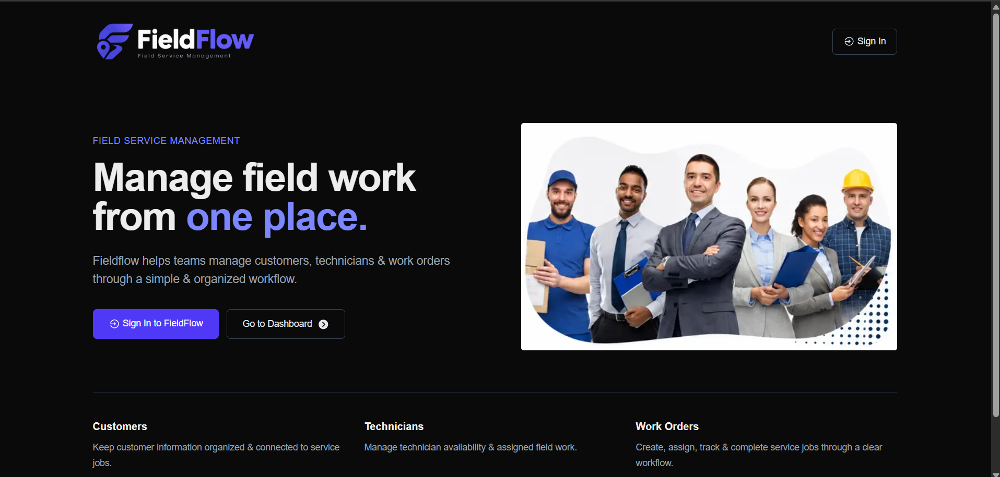

The FieldFlow home page provides an introduction to the system and navigation to the application.

### Login

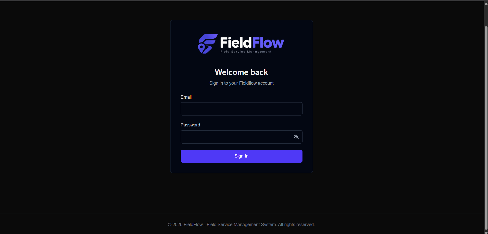

The login page provides email/password authentication for FieldFlow users.

### Admin Dashboard

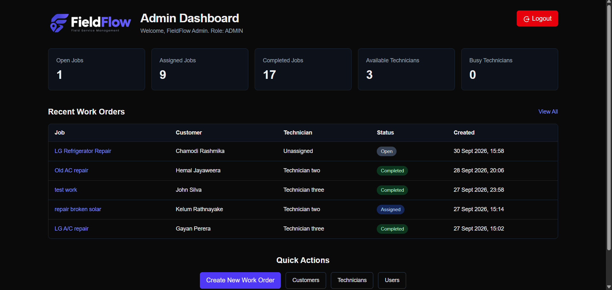

The Admin dashboard provides an overview of work orders, technicians, and recent activity.

### Dispatcher Dashboard

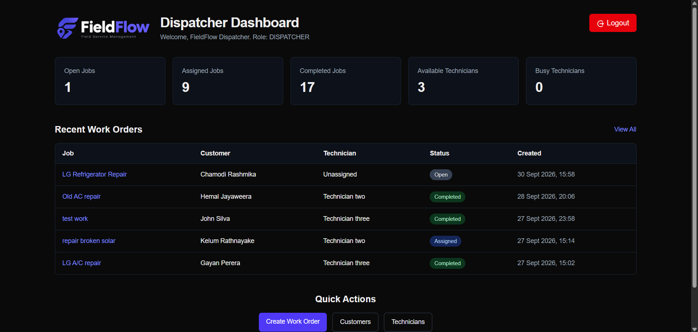

The Dispatcher dashboard provides access to customer, technician, and work-order management.

### Technician Dashboard

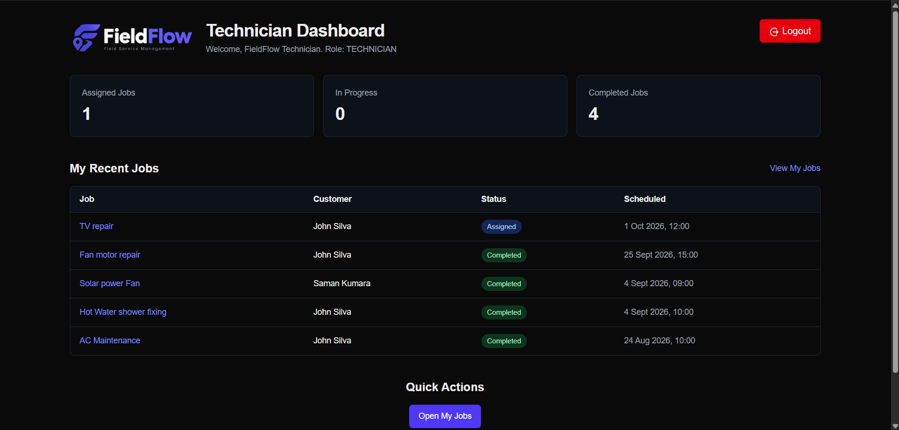

The Technician dashboard displays assigned-job information and technician-specific work statistics.

### Customers

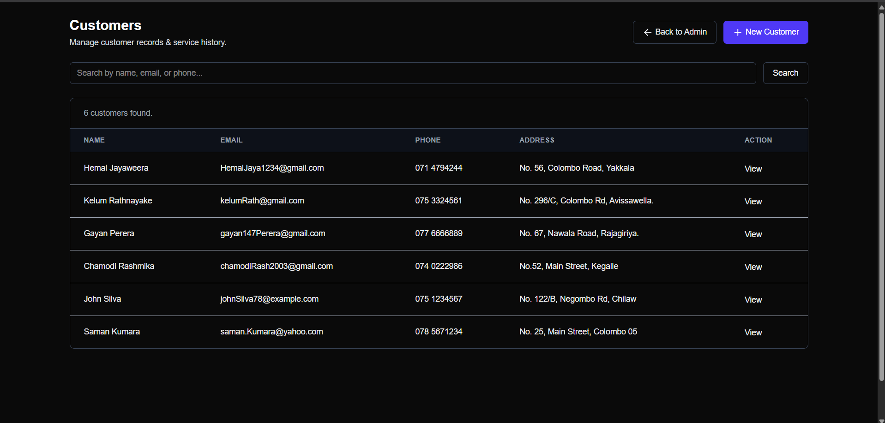

The customer management page allows authorized users to create, search, view, and edit customer records.

### Technicians

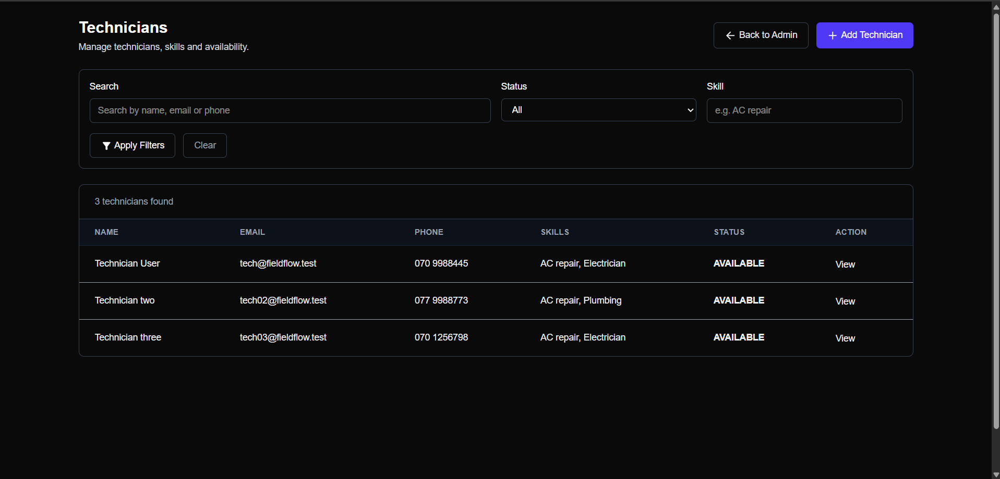

The technician management page allows authorized users to manage technician profiles, skills, and availability.

### Work Orders

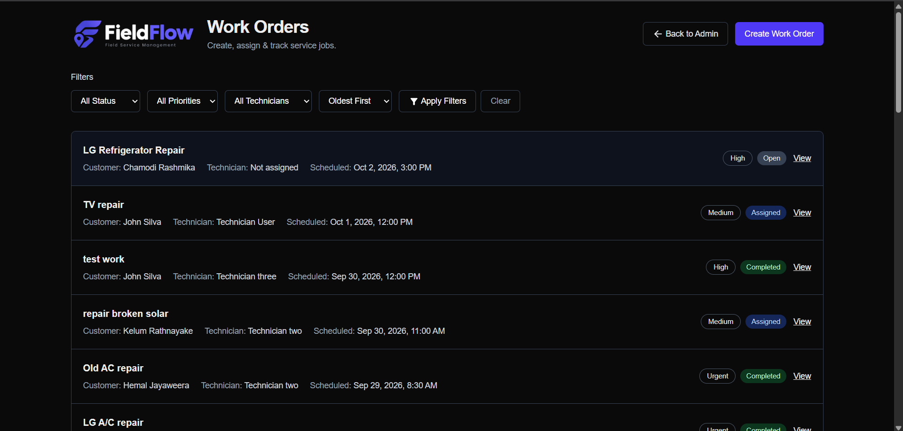

The work-order list provides filtering and access to work-order records.

### Work Order Details

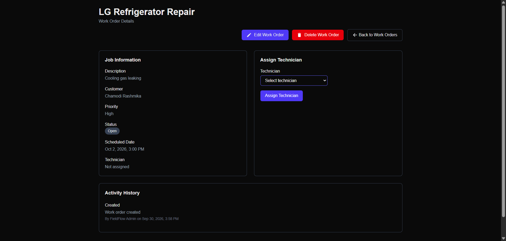

The work-order details page displays job information, assignment, status, and activity history.

### Technician My Jobs

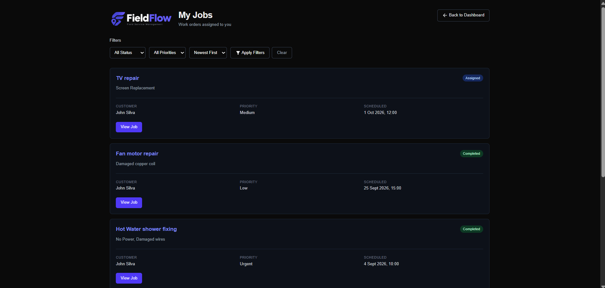

The My Jobs page allows technicians to view and work on their assigned jobs.

### Work Order Completion

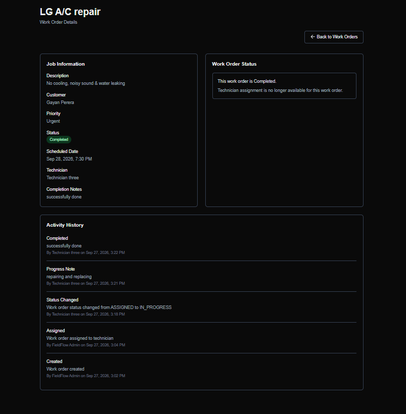

Technicians can add progress and completion notes before completing an assigned work order.


---

## Technology Stack

* Next.js 16
* React 19
* TypeScript
* Tailwind CSS
* PostgreSQL
* Neon
* Prisma 7
* Better Auth
* Zod
* Vitest
* Playwright
* Vercel

---

## Architecture

FieldFlow follows a server-driven architecture using the Next.js App Router.

┌─────────────────────────────┐
│        Browser / UI         │
│     Next.js + React         │
└──────────────┬──────────────┘
               │
               ▼
┌─────────────────────────────┐
│ Server Actions / Pages      │
│ Authentication              │
│ Authorization               │
│ Validation                  │
│ Business Rules              │
└──────────────┬──────────────┘
               │
               ▼
┌─────────────────────────────┐
│           Prisma            │
│       Prisma Client         │
└──────────────┬──────────────┘
               │
               ▼
┌─────────────────────────────┐
│       Neon PostgreSQL       │
└─────────────────────────────┘
```

The application does not require separate microservices, Redis, or an API gateway.

---

## Project Structure

Important application files are organized as follows:

fieldflow/
│
├── app/
│   ├── admin/
│   ├── dispatcher/
│   ├── technician/
│   ├── customers/
│   ├── technicians/
│   ├── users/
│   ├── work-orders/
│   ├── my-jobs/
│   ├── dashboard/
│   ├── login/
│   ├── components/
│   ├── page.tsx
│   ├── layout.tsx
│   └── globals.css
│
├── lib/
│   ├── auth.ts
│   ├── auth-client.ts
│   ├── auth-utils.ts
│   ├── prisma.ts
│   ├── date-utils.ts
│   ├── status.ts
│   ├── status.test.ts
│   ├── work-order-rules.ts
│   └── work-order-rules.test.ts
│
├── prisma/
│   ├── migrations/
│   └── schema.prisma
│
├── scripts/
│   └── seed-users.ts
│
├── tests/
│   ├── auth.spec.ts
│   ├── home.spec.ts
│   └── work-order-flow.spec.ts
│
├── public/
│
├── .env.example
├── package.json
├── playwright.config.ts
├── tsconfig.json
└── README.md
```

---

## Database

FieldFlow uses PostgreSQL hosted on Neon and Prisma as the ORM.

The main business models are:

User
 │
 └── Technician

Customer
 │
 └── WorkOrder
        │
        ├── Technician
        └── Activity
```

### Main Models

#### User

Stores authenticated application users and their roles.

Roles:

ADMIN
DISPATCHER
TECHNICIAN

#### Technician

Stores technician-specific information including:

* Name
* Email
* Phone
* Skills
* Availability/status
* Connected user account

Technician statuses:

AVAILABLE
BUSY
UNAVAILABLE

#### Customer

Stores customer information including:

* Name
* Email
* Phone
* Address

#### WorkOrder

Stores field-service jobs including:

* Title
* Description
* Customer
* Technician
* Priority
* Status
* Scheduled date
* Completion notes
* Created/updated timestamps

Priorities:

LOW
MEDIUM
HIGH
URGENT

Statuses:

OPEN
ASSIGNED
IN_PROGRESS
COMPLETED
CANCELLED


#### Activity

Stores work-order activity history including:

* User
* Work order
* Action
* Optional note
* Timestamp

This provides a record of important work-order actions and status changes.

## Required Routes

The main application routes include:

/login
/dashboard
/users
/customers
/technicians
/work-orders
/work-orders/new
/work-orders/[id]
/my-jobs


Role-specific dashboards are also available for Admin, Dispatcher, and Technician users.

---

## Authentication and Authorization

Better Auth is used for authentication.

The application uses:

* Email/password authentication
* Session-based authentication
* Protected server pages
* Server-side role checks
* Technician ownership checks
* Protected server actions

Important authorization rules include:

* Admin can manage users.
* Admin and Dispatcher can create and assign work orders.
* Technicians can only work with jobs assigned to them.
* A technician cannot start an unassigned job.
* A work order cannot be completed without completion notes.
* Unauthorized users are blocked on the server even if they attempt to access protected functionality directly.

---

## Validation and Business Rules

Zod is used to validate untrusted form input before database operations.

Business rules are also enforced on the server.

Examples include:

* Required work-order fields must be valid.
* Customers must exist before creating a work order.
* Technicians must exist before assignment.
* Only eligible technicians can be assigned.
* Only authorized roles can perform administrative actions.
* Technicians can only update their assigned work orders.
* Work-order status transitions are validated.
* Completion notes are required before completing a job.
* Important status changes are recorded in the activity history.

---

## Getting Started

### Prerequisites

Install the following before running the project:

* Node.js
* npm
* PostgreSQL-compatible database
* Neon account/database for the project

The project was developed using a Neon PostgreSQL database.

---

### 1. Clone the Repository

git clone "https://github.com/charithgaya/fieldflow.git"
cd fieldflow
```

---

### 2. Install Dependencies

npm install
```

---

### 3. Configure Environment Variables

Create a `.env` file in the project root.

Use `.env.example` as the template:

DATABASE_URL="your_neon_database_connection_string"
BETTER_AUTH_SECRET="your_better_auth_secret"
BETTER_AUTH_URL="http://localhost:3000"

### Environment Variables

| Variable             | Purpose                                            |
| -------------------- | -------------------------------------------------- |
| `DATABASE_URL`       | Connection string for the Neon PostgreSQL database |
| `BETTER_AUTH_SECRET` | Secret used by Better Auth                         |
| `BETTER_AUTH_URL`    | Base URL used by Better Auth                       |


### 4. Generate Prisma Client

npx prisma generate

---

### 5. Apply Database Migrations

For an existing database with the project's migrations:

npx prisma migrate deploy

During local development, Prisma migrations can also be created/applied using:

npx prisma migrate dev

---

### 6. Seed Demo Users

The project includes a user seed script:

npm run seed:users

This creates demo accounts for the three required application roles.

Demo account information should be provided separately for evaluation rather than committing sensitive credentials to the repository.

---

### 7. Start the Development Server

npm run dev

Open:

http://localhost:3000

---

## Testing

FieldFlow uses both unit testing and end-to-end testing.

### Unit Tests

Vitest is used for application/business-rule tests.

Run:

npm test

The project includes tests for work-order rules and status formatting.

---

### End-to-End Tests

Playwright is used to test important user workflows through the browser.

Run:

npx playwright test


The Playwright configuration starts the Next.js development server automatically when required.

The E2E test suite covers areas including:

* Authentication
* Home page
* Work-order workflow

---

## Code Quality

The project includes ESLint configuration for code-quality checks.

Run:

npm run lint

---

## Production Build

Create a production build with:

npm run build

Start the production application with:

npm start


The build process also generates the Prisma client.

---

## Deployment

FieldFlow is deployed using Vercel with Neon PostgreSQL as the production database.

Before deploying, configure the required environment variables in the deployment platform:

DATABASE_URL
BETTER_AUTH_SECRET
BETTER_AUTH_URL


The production `BETTER_AUTH_URL` should point to the deployed application URL.

### Live Application

**Live URL:** "https://fieldflow-nu-eight.vercel.app/"

---

## Demo Accounts

The project includes demo users for the required roles.

| Role       | Email                     |
| ---------- | ------------------------- |
| Admin      | `admin@fieldflow.test`    |
| Dispatcher | `dispatch@fieldflow.test` |
| Technician | `tech@fieldflow.test`     |

Passwords should be shared separately with evaluators rather than published as repository documentation.

---

## Security

FieldFlow follows several security practices required by the project brief:

* Server-side authentication checks
* Server-side role authorization
* Technician ownership checks
* Zod input validation
* Protected server actions
* Better Auth password handling
* Environment variables for sensitive configuration
* No `.env` files committed to Git
* No reliance on UI visibility alone for authorization
* Unauthorized users are blocked from protected operations

---

## Responsive UI and Usability

The application was designed to support desktop and smaller-screen layouts using Tailwind CSS.

The UI includes:

* Consistent navigation
* Clear page titles
* Form validation feedback
* Loading states
* Empty states
* Error handling
* Readable status indicators
* Responsive layouts
* Confirmation before destructive work-order actions

The primary FieldFlow interface uses an indigo-based visual style.

---

## Project Testing and Verification

The project was tested progressively during development.

Verification included:

* Authentication and role access
* Customer creation and editing
* Technician creation and editing
* Work-order creation
* Technician assignment
* Technician job workflow
* Progress notes
* Completion notes
* Status transitions
* Activity history
* Authorization restrictions
* Work-order editing
* Work-order deletion rules
* Dashboard data
* Unit tests
* End-to-end browser tests
* Production build
* Deployment

---

## Known Limitations

The following features are outside the minimum core scope of the project and were not required for the core FieldFlow system:

* Mobile application
* Route optimization
* Payment gateway
* SMS/paid notification systems
* Inventory valuation
* Warehouse transfer management
* IoT/GPS/QR hardware integrations

The project brief identifies some additional features, such as email notifications, calendar functionality, CSV export, customer-history export, and basic charts, as optional improvements after the core system.

---

## Project Requirements

FieldFlow was developed according to the CCA Full-Stack Developer Internship Project Brief.

The required core areas are:

* Authentication
* Role-based access
* Customers
* Technicians
* Work orders
* Dashboard

The core system connects these areas into one complete workflow from work-order creation and assignment through technician completion.

---

## Project Repository

**GitHub Repository:** "https://github.com/charithgaya/fieldflow.git"

**Live Application:** "https://fieldflow-nu-eight.vercel.app/"

---

## Internship Project

**Project:** FieldFlow
**Type:** Full-Stack Field Service Management System
**Internship:** CCA Full-Stack Developer Internship
**Development Period:** Eight weeks
**My name** R.A.Charith Gayashan Deshapiya
**Email** charithgdr@gmail.com

Built using Next.js, React, TypeScript, Tailwind CSS, PostgreSQL, Neon, Prisma, Better Auth, Zod, Vitest, Playwright, and Vercel.
